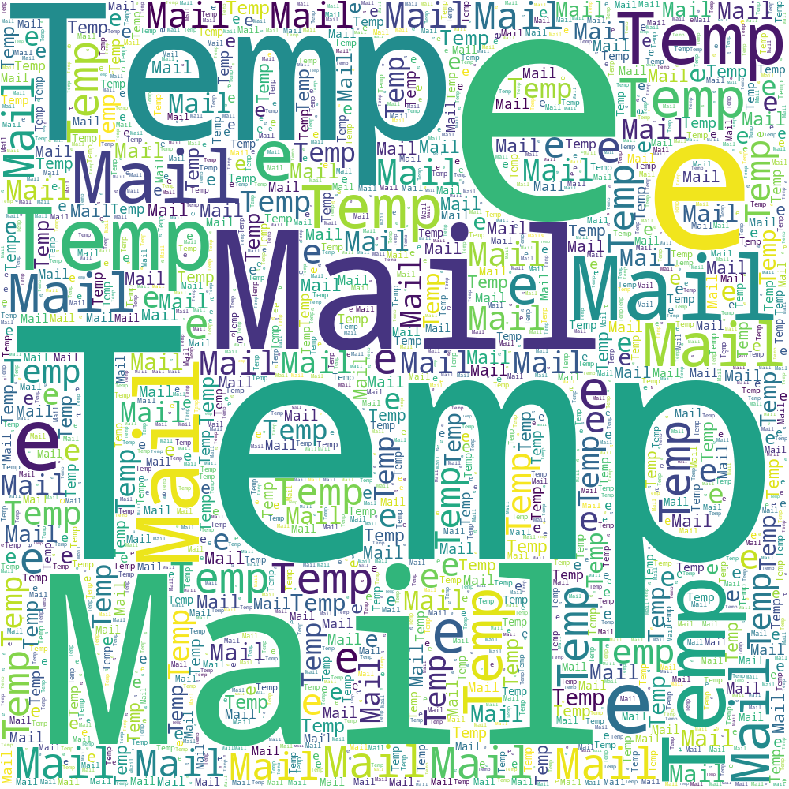

<!-- PROJECT LOGO -->
<br />
<p align="center">
  <a href="https://github.com/othneildrew/Best-README-Template">
    
  </a>

  <h3 align="center">Best-README-Template</h3>

  <p align="center">
    An awesome README template to jumpstart your projects!
    <br />
    <a href="https://github.com/karthikmprakash/Temp-e-mail-Telegram-Bot"><strong>Explore the docs »</strong></a>
    <br />
    <br />
    <a href="https://github.com/karthikmprakash/Temp-e-mail-Telegram-Bot/issues">Report Bug</a>
    ·
    <a href="https://github.com/karthikmprakash/Temp-e-mail-Telegram-Bot/issues">Request Feature</a>
  </p>
</p>


# Temporary Email genration with Telegram Bot: Overview 
* Created a bot to generate username ,  temporary email and password for websites that could potentially track your personal data.
* It uses the 10minmail service to generate a new email instance and returns back to the user. 
* Users can easily interact with the bot with the Markup Keyboard that primarily focuses on the Bot's features
* Uses webhooks instead of polling to increase the bots response time and for effecient requests handling

## Code and Resources Used 
**Python Version:** 3.7  
**Packages:** python-telegram-bot requests beautifulsoup4 python-dotenv urllib3   
**For Web Framework Requirements:**  ```pip install -r requirements.txt```  
**Pyhton-telegram-bot Github:** https://github.com/python-telegram-bot/python-telegram-bot    
**Telegram Bot API:** https://core.telegram.org/bots/api#message   
**Telegram Bot Documentation:** https://python-telegram-bot.readthedocs.io/en/stable/index.html  
**Telegram Webhooks:** https://github.com/gcatanese/TelegramBotDemo/blob/main/telegram_bot/telegram_bot.py 

## Working Model  
Anyone can make use of the bot by searching for @temp_e_mail_bot in the telegram messenger


## Productionization 
After 


<!-- MARKDOWN LINKS & IMAGES -->
<!-- https://www.markdownguide.org/basic-syntax/#reference-style-links -->
[contributors-shield]: https://img.shields.io/github/contributors/othneildrew/Best-README-Template.svg?style=for-the-badge
[contributors-url]: https://github.com/othneildrew/Best-README-Template/graphs/contributors
[forks-shield]: https://img.shields.io/github/forks/othneildrew/Best-README-Template.svg?style=for-the-badge
[forks-url]: https://github.com/karthikmprakash/Temp_email_Telegram_bot/network/members
[stars-shield]: https://img.shields.io/github/stars/othneildrew/Best-README-Template.svg?style=for-the-badge
[stars-url]: https://github.com/othneildrew/Best-README-Template/stargazers
[issues-shield]: https://img.shields.io/github/issues/othneildrew/Best-README-Template.svg?style=for-the-badge
[issues-url]: https://github.com/othneildrew/Best-README-Template/issues
[license-shield]: https://img.shields.io/github/license/othneildrew/Best-README-Template.svg?style=for-the-badge
[license-url]: https://github.com/othneildrew/Best-README-Template/blob/master/LICENSE.txt
[linkedin-shield]: https://img.shields.io/badge/-LinkedIn-black.svg?style=for-the-badge&logo=linkedin&colorB=555
[linkedin-url]: https://linkedin.com/in/othneildrew
[product-screenshot]: images/screenshot.png
