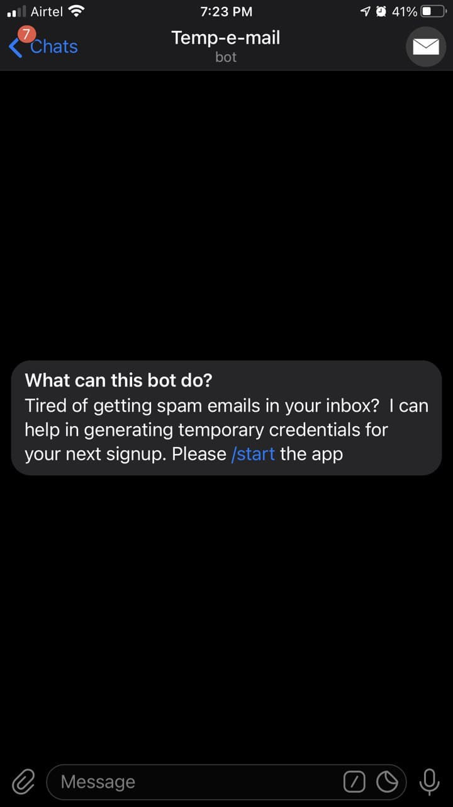
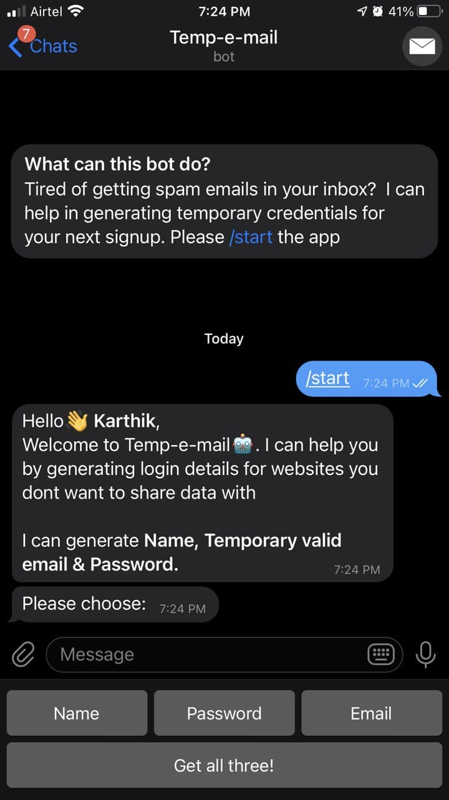
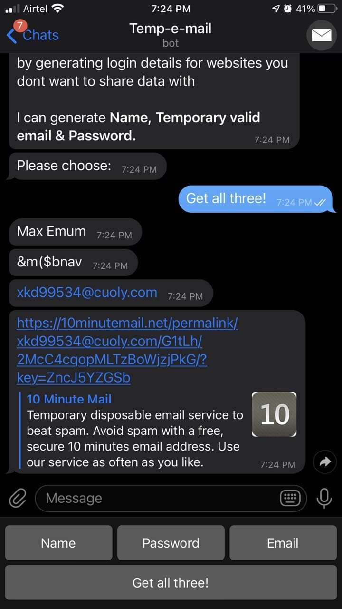

<!-- PROJECT LOGO -->
<br />
<p align="center">
  <a href="https://github.com/othneildrew/Best-README-Template">
    
  </a>

  <h3 align="center">temp-e-mail</h3>

  <p align="center">
    A handy bot to fetch temporary emails for your next Signup!
    <br />
    <a href="https://github.com/karthikmprakash/Temp-e-mail-Telegram-Bot"><strong>Explore the docs »</strong></a>
    <br />
    <br />
    <a href="https://github.com/karthikmprakash/Temp-e-mail-Telegram-Bot/issues">Report Bug</a>
    ·
    <a href="https://github.com/karthikmprakash/Temp-e-mail-Telegram-Bot/issues">Request Feature</a>
  </p>
</p>


# Temporary Email genration with Telegram Bot: Overview 
* Created a bot to generate username ,  temporary email and password for websites that could potentially track your personal data.
* It uses the 10minmail service to generate a new email instance and returns back to the user. 
* Users can easily interact with the bot with the Markup Keyboard that primarily focuses on the Bot's features
* Uses webhooks instead of polling to increase the bots response time and for effecient requests handling

## Code and Resources Used 
**Python Version:** 3.7  
**Packages:** python-telegram-bot requests beautifulsoup4 python-dotenv urllib3   
**For Web Framework Requirements:**  ```pip install -r requirements.txt```  
**Pyhton-telegram-bot Github:** https://github.com/python-telegram-bot/python-telegram-bot    
**Telegram Bot API:** https://core.telegram.org/bots/api#message   
**Telegram Bot Documentation:** https://python-telegram-bot.readthedocs.io/en/stable/index.html  
**Telegram Webhooks:** https://github.com/gcatanese/TelegramBotDemo/blob/main/telegram_bot/telegram_bot.py    
**Run on Boot(Linux):** https://tecadmin.net/setup-autorun-python-script-using-systemd/

## Usage
* git clone https://github.com/karthikmprakash/Temp-e-mail-Telegram-Bot.git
* edit the file `main.py` by adding your telegram bot API Token
* Then in the terminal ```bash python3 main.py``` , your bot should start sending responses

### To run the script on system reboot (Ubuntu)
1. Have the python application ready
2. Create a [Service File](https://www.digitalocean.com/community/tutorials/understanding-systemd-units-and-unit-files)
    - The file must have .service extension under /lib/systemd/system/ directory
    - ```bash 
      sudo vi /lib/systemd/system/telegram_bot.service
      ```
    - and add the following content in it. Change Python script filename ad location. Also update the Description.
    - ```bash
      [Unit]
      Description=Dummy Service
      After=multi-user.target
      Conflicts=getty@tty1.service

      [Service]
      Type=simple
      ExecStart=/usr/bin/python3 /home/user-directory/path-to-python-script
      StandardInput=tty-force

      [Install]
      WantedBy=multi-user.target
      ```
3. Enable Newly Added Service
    - Your system service has been added to your service. Let’s reload the systemctl daemon to read new file. You need to reload this deamon each time after making any changes         in in .service file.
    - ```bash
      sudo systemctl daemon-reload
      ```
    - Now enable the service to start on system boot, also start the service using the following commands.
    - ```bash
      sudo systemctl enable telegram_bot.service
      sudo systemctl start telegram_bot.service
      ```
    - Finally check the status of your service as following command
    - ```bash
      sudo systemctl status telegram_bot.service
      ```

## Working Model  

> Anyone can make use of the bot by searching for **@temp_e_mail_bot** in the telegram messenger

<p align="center">


## Productionization 
There are bunch of different ways to get the bot up and working. Its feasible to use polling while testing the bot in the local environment but once its in the production stage ,its better to use webhooks with a cloud server. You can build your own too!

  * Deployment on a Raspberry Pi
  * IAAS Servers for ex: Amazon AWS EC2 , MS Azure
  * PAAS Server for ex: Heroku , Rackspace 
 
 


<!-- MARKDOWN LINKS & IMAGES -->
<!-- https://www.markdownguide.org/basic-syntax/#reference-style-links -->
[contributors-shield]: https://img.shields.io/github/contributors/othneildrew/Best-README-Template.svg?style=for-the-badge
[contributors-url]: https://github.com/othneildrew/Best-README-Template/graphs/contributors
[forks-shield]: https://img.shields.io/github/forks/othneildrew/Best-README-Template.svg?style=for-the-badge
[forks-url]: https://github.com/karthikmprakash/Temp_email_Telegram_bot/network/members
[stars-shield]: https://img.shields.io/github/stars/othneildrew/Best-README-Template.svg?style=for-the-badge
[stars-url]: https://github.com/othneildrew/Best-README-Template/stargazers
[issues-shield]: https://img.shields.io/github/issues/othneildrew/Best-README-Template.svg?style=for-the-badge
[issues-url]: https://github.com/othneildrew/Best-README-Template/issues
[license-shield]: https://img.shields.io/github/license/othneildrew/Best-README-Template.svg?style=for-the-badge
[license-url]: https://github.com/othneildrew/Best-README-Template/blob/master/LICENSE.txt
[linkedin-shield]: https://img.shields.io/badge/-LinkedIn-black.svg?style=for-the-badge&logo=linkedin&colorB=555
[linkedin-url]: https://linkedin.com/in/othneildrew
[product-screenshot]: images/screenshot.png
